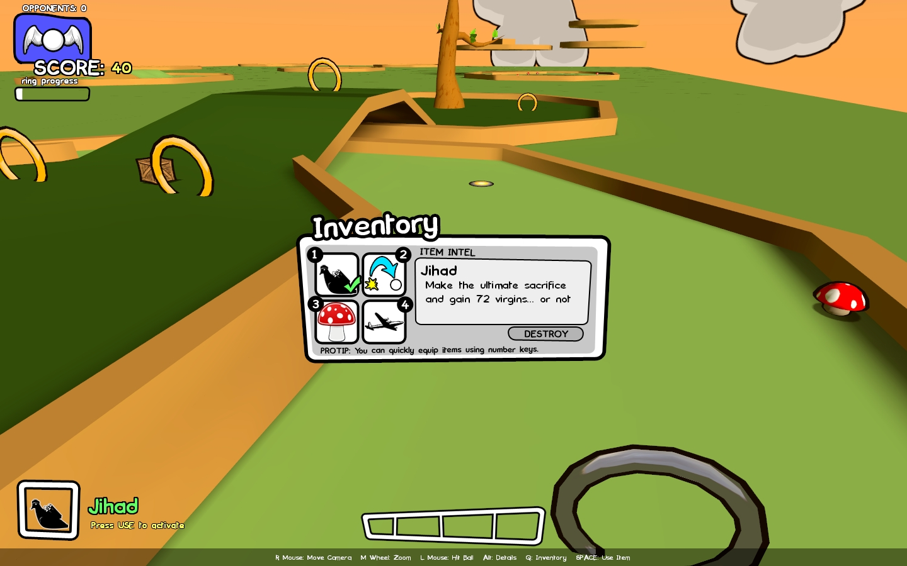

Zinger!
======

Zinger! is a team based fretta gamemode that combines action, adventure and strategy wrapped around a game of mini golf. Shoot, trap, drug and destroy your opponents with a ridiculous arsenal of weapons at your disposal. Battle along side your teammates and claim your victory on each hole. With the course as your battleground and the cup as your goal, you'll need to avoid obstacles, teleport distances and jump across a melody of puzzles. Zinger! bundles all this excitement and more with a rich visual style and cartoon atmosphere; blending a 2D backdrop into a 3D world.

## Links
[Zinger!'s 2nd place victory in the Facepunch Fretta Contest!](http://web.archive.org/web/20110710215632/http://frettacontest.facepunchstudios.com/)
[Zinger! ModDB page](http://www.moddb.com/mods/zinger)
[Original Zinger! Facepunch thread](http://facepunch.com/showthread.php?t=544410)

## Media
(Click for full size)

<a href="backgrounds/zinger_01.jpg?raw=true"></a>
<a href="backgrounds/zinger_02.jpg?raw=true"></a>
<a href="backgrounds/zinger_03.jpg?raw=true"></a>
<a href="backgrounds/zinger_04.jpg?raw=true"></a>
<a href="backgrounds/zinger_05.jpg?raw=true"></a>
<a href="backgrounds/zinger_06.jpg?raw=true"></a>
<a href="backgrounds/zinger_07.jpg?raw=true"></a>
<a href="backgrounds/zinger_08.jpg?raw=true"></a>
<a href="backgrounds/zinger_09.jpg?raw=true"></a>
<a href="backgrounds/zinger_10.jpg?raw=true"></a>
<a href="backgrounds/zinger_11.jpg?raw=true"></a>
<a href="backgrounds/zinger_12.jpg?raw=true"></a>
<a href="backgrounds/zinger_13.jpg?raw=true"></a>
<a href="backgrounds/zinger_14.jpg?raw=true"></a>
<a href="backgrounds/zinger_15.jpg?raw=true"></a>
<a href="backgrounds/zinger_16.jpg?raw=true"></a>

[](http://www.youtube.com/watch?v=XtSgjyyvHvw)

## Legal
```
All sounds found within "content/sound/zinger" and any
subfolders have been released under the
"Create Commons Sampling Plus 1.0" license

http://creativecommons.org/licenses/sampling+/1.0/

Sound files are original field recordings or
mashed up and resampled from clips found on
freesound.org website

More information: http://www.freesound.org/legal.php
```
```
Music in content/sound/zinger/music was created by Kevin Macleod.
Music: Kevin MacLeod (incompetech.com)
Licensed under Creative Commons "Attribution 3.0"
http://creativecommons.org/licenses/by/3.0/"


More information:
http://incompetech.com/m/c/royalty-free/faq.html
```
```
All models found within "content/models/zinger" and any
subfolders have been released under the
"Create Commons Attribution 3.0" license

http://creativecommons.org/licenses/by/3.0/us/

They have been created from scratch.
```
```
  ____                _      _    ____              _
 / ___|___  _ __ ___ (_) ___| | _| __ )  ___   ___ | | __
| |   / _ \| '_ ` _ \| |/ __| |/ /  _ \ / _ \ / _ \| |/ /
| |__| (_) | | | | | | | (__|   <| |_) | (_) | (_) |   <
 \____\___/|_| |_| |_|_|\___|_|\_\____/ \___/ \___/|_|\_\

A font for comics.

It's not perfect, but I think it's pretty snazzy.

Feel free to post this on other sites... just give credit to me. And preferably a link to http://www.oufoufsworld.co.uk.

ouf-ouf
ComickBook_Simple font created by http://www.oufoufsworld.co.uk.
```
